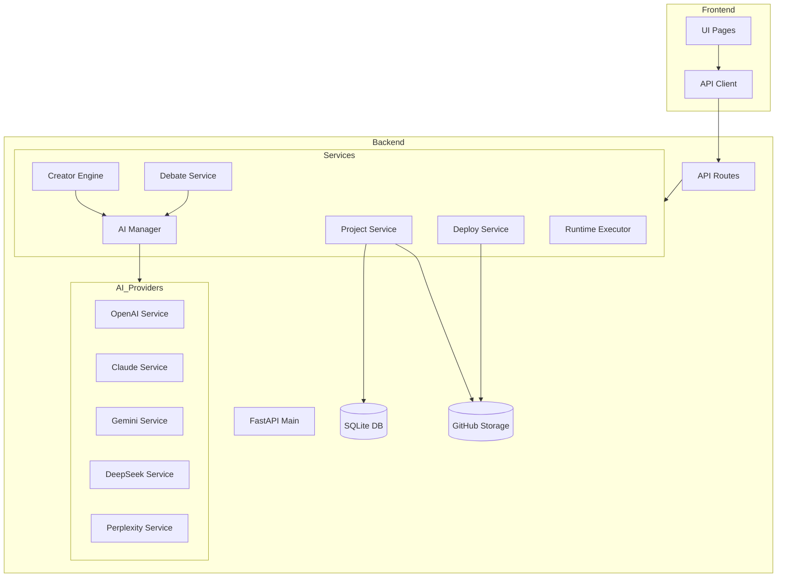

# نقشه راه پروژه - AI Creator Engine
## Roadmap - موتور خالق هوشمند

**آخرین به‌روزرسانی:** 2026-01-27
**نسخه فعلی:** 2.0.0
**وضعیت:** در حال توسعه فعال

---

## فهرست مطالب
- [خلاصه اجرایی](#خلاصه-اجرایی)
- [وضعیت فعلی پروژه](#وضعیت-فعلی-پروژه)
- [تحلیل ساختار](#تحلیل-ساختار)
- [مشکلات و نقاط ضعف شناسایی‌شده](#مشکلات-و-نقاط-ضعف-شناسایی‌شده)
- [حالت ایده‌آل](#حالت-ایده‌آل)
- [قابلیت‌های برنامه‌ریزی‌شده](#قابلیت‌های-برنامه‌ریزی‌شده)
- [نقشه راه فازبندی‌شده](#نقشه-راه-فازبندی‌شده)
- [سیستم بررسی خودکار](#سیستم-بررسی-خودکار)
- [پروفایل و اعتبارسنجی مدل‌ها](#پروفایل-و-اعتبارسنجی-مدل‌ها)

---

## خلاصه اجرایی

**AI Creator Engine** یک پلتفرم جامع برای:
- تولید پروژه‌های نرم‌افزاری با هوش مصنوعی
- مدیریت چندین مدل AI از پروایدرهای مختلف
- مناظره و همکاری بین مدل‌های AI
- استقرار یک‌کلیکی به Render و Railway
- تحلیل و نظارت بر پروژه‌ها

---

## وضعیت فعلی پروژه

### تکنولوژی‌های مورد استفاده

| لایه | تکنولوژی | نسخه |
|------|----------|------|
| **Frontend** | Next.js + TypeScript | 14.1.0 |
| **Backend** | FastAPI + Python | 0.109.0+ |
| **Database** | SQLite + SQLAlchemy | WAL Mode |
| **Styling** | Tailwind CSS | 3.4.1 |
| **State** | Zustand | 4.4.7 |
| **Visualization** | Mermaid + Reactflow | 10.6.1 |

### پروایدرهای AI پشتیبانی‌شده

| پروایدر | مدل‌ها | وضعیت |
|---------|--------|-------|
| OpenAI | GPT-4o, GPT-4o Mini, GPT-4 Turbo, GPT-3.5, DALL-E 3 | ✅ فعال |
| Anthropic | Claude Sonnet 4, Claude 3.5 Sonnet, Claude 3 Haiku | ✅ فعال |
| Google | Gemini 2.5 Pro, Gemini 2.5 Flash, Imagen 3 | ✅ فعال |
| DeepSeek | DeepSeek Chat, DeepSeek Coder, DeepSeek Reasoner | ✅ فعال |
| Perplexity | Sonar Pro, Sonar, Sonar Reasoning | ✅ فعال |
| Groq | مدل‌های سریع | ✅ فعال |
| OpenRouter | Multi-provider | ✅ فعال |

### صفحات موجود در Frontend

| صفحه | مسیر | وضعیت | توضیح |
|------|------|-------|-------|
| خانه | `/` | ✅ | داشبورد اصلی |
| موتور خالق | `/creator` | ✅ | تولید پروژه با AI |
| پروژه‌ها | `/projects` | ✅ | مدیریت و لیست پروژه‌ها |
| جزئیات پروژه | `/project/[id]` | ✅ | مشاهده فایل‌ها و deploy |
| مناظره | `/debate` | ✅ | مناظره بین AI ها |
| نمودارها | `/diagrams` | ✅ | تولید نمودار Mermaid |
| تنظیمات | `/settings` | ✅ | مدیریت API keys |
| مدل‌ها | `/models` | ✅ | لیست مدل‌های AI |
| آرشیو | `/archive` | ✅ | تاریخچه و فایل‌ها |

### سرویس‌های Backend

| سرویس | فایل | خطوط کد | وضعیت |
|-------|------|---------|-------|
| Smart Orchestrator | `smart_orchestrator.py` | ~2,189 | ✅ پیچیده |
| Creator Engine | `creator_engine.py` | ~1,249 | ✅ کامل |
| Debate Service | `debate_service.py` | ~1,081 | ✅ کامل |
| Project Service | `project_service.py` | ~997 | ✅ کامل |
| AI Manager | `ai_manager.py` | ~400+ | ✅ کامل |
| Deploy Service | `deploy_service.py` | ~500+ | ✅ کامل |
| GitHub Import | `github_import.py` | ~400+ | ✅ کامل |
| Runtime Executor | `runtime_executor.py` | ~600+ | ✅ کامل |

---

## تحلیل ساختار

### ساختار فعلی پروژه

```
project-management/
├── backend/                          # بک‌اند FastAPI
│   ├── app/
│   │   ├── api/routes/              # 20+ route file
│   │   │   ├── projects.py          # مدیریت پروژه
│   │   │   ├── creator.py           # موتور خالق
│   │   │   ├── debate.py            # مناظره
│   │   │   ├── models.py            # مدل‌های AI
│   │   │   ├── settings.py          # تنظیمات
│   │   │   ├── diagrams.py          # نمودارها
│   │   │   ├── runtime.py           # اجرای پروژه
│   │   │   ├── github_import.py     # ایمپورت GitHub
│   │   │   ├── project_structure.py # دیاگرام ساختار
│   │   │   └── project_journal.py   # ژورنال و گزارش
│   │   ├── core/
│   │   │   ├── config.py            # تنظیمات اصلی
│   │   │   ├── database.py          # اتصال دیتابیس
│   │   │   ├── models_registry.py   # رجیستری مدل‌ها
│   │   │   └── roles.py             # نقش‌های AI
│   │   ├── models/                  # مدل‌های دیتابیس
│   │   │   ├── project.py
│   │   │   ├── debate.py
│   │   │   └── setting.py
│   │   ├── services/                # 27+ service file
│   │   │   ├── ai_manager.py        # مدیریت مرکزی AI
│   │   │   ├── ai_base.py           # کلاس پایه AI
│   │   │   ├── openai_service.py    # سرویس OpenAI
│   │   │   ├── claude_service.py    # سرویس Claude
│   │   │   ├── gemini_service.py    # سرویس Gemini
│   │   │   ├── deepseek_service.py  # سرویس DeepSeek
│   │   │   ├── perplexity_service.py# سرویس Perplexity
│   │   │   ├── creator_engine.py    # موتور تولید کد
│   │   │   ├── debate_service.py    # سرویس مناظره
│   │   │   ├── project_service.py   # سرویس پروژه
│   │   │   ├── deploy_service.py    # سرویس استقرار
│   │   │   ├── github_storage.py    # ذخیره‌سازی GitHub
│   │   │   ├── github_import.py     # ایمپورت از GitHub
│   │   │   ├── smart_orchestrator.py# هماهنگ‌کننده هوشمند
│   │   │   └── runtime_executor.py  # اجرای با Docker
│   │   └── main.py                  # نقطه ورود
│   ├── requirements.txt
│   └── Dockerfile
├── frontend/                         # فرانت‌اند Next.js
│   ├── src/
│   │   ├── app/
│   │   │   ├── page.tsx             # صفحه اصلی
│   │   │   ├── layout.tsx           # لایه‌بندی
│   │   │   ├── creator/page.tsx     # موتور خالق
│   │   │   ├── projects/page.tsx    # لیست پروژه‌ها
│   │   │   ├── project/[id]/page.tsx# جزئیات پروژه
│   │   │   ├── debate/page.tsx      # مناظره
│   │   │   ├── diagrams/page.tsx    # نمودارها
│   │   │   ├── settings/page.tsx    # تنظیمات
│   │   │   ├── models/page.tsx      # مدل‌ها
│   │   │   └── archive/page.tsx     # آرشیو
│   │   ├── components/
│   │   │   ├── Layout.tsx           # کامپوننت اصلی
│   │   │   └── FileUpload.tsx
│   │   ├── services/api.ts
│   │   └── types/index.ts
│   ├── package.json
│   └── Dockerfile
├── README.md
├── ARCHITECTURE.md
├── ROADMAP.md                        # این فایل
├── docker-compose.yml
└── render.yaml
```

### ارتباطات سرویس‌ها (Service Wiring)



---

## مشکلات و نقاط ضعف شناسایی‌شده

### مشکلات بحرانی (Critical) 🔴

| # | مشکل | تأثیر | فایل/محل |
|---|------|-------|----------|
| C1 | عدم وجود سیستم بررسی خودکار پروژه | نمی‌توان سلامت پروژه‌ها را ارزیابی کرد | - |
| C2 | عدم وجود پروفایل و نمره‌دهی مدل‌ها | نمی‌توان عملکرد مدل‌ها را ردیابی کرد | - |
| C3 | عدم نمایش رنگی سلامت در دیاگرام | کاربر نمی‌تواند وضعیت را سریع بفهمد | `diagrams/page.tsx` |

### مشکلات مهم (High) 🟠

| # | مشکل | تأثیر | فایل/محل |
|---|------|-------|----------|
| H1 | README ناقص | مستندات کافی نیست | `README.md` |
| H2 | ARCHITECTURE قدیمی | ساختار واقعی منعکس نشده | `ARCHITECTURE.md` |
| H3 | عدم وجود سیستم گزارش‌گیری جامع | نمی‌توان گزارش کامل گرفت | - |
| H4 | عدم زمان‌بندی برای بررسی خودکار | بررسی‌ها دستی هستند | - |
| H5 | smart_orchestrator خیلی بزرگ | نگهداری سخت | `smart_orchestrator.py` (2189 خط) |

### مشکلات متوسط (Medium) 🟡

| # | مشکل | تأثیر | فایل/محل |
|---|------|-------|----------|
| M1 | عدم تست‌های خودکار | کیفیت کد نامشخص | - |
| M2 | Logging ناقص | عیب‌یابی سخت | چندین سرویس |
| M3 | عدم rate limiting | امکان سوءاستفاده | API routes |
| M4 | CORS کاملاً باز | امنیت پایین | `main.py` |
| M5 | عدم caching مناسب | کارایی پایین‌تر | - |

### مشکلات کم‌اهمیت (Low) 🟢

| # | مشکل | تأثیر | فایل/محل |
|---|------|-------|----------|
| L1 | کامنت‌های ناکافی | فهم کد سخت‌تر | چندین فایل |
| L2 | Type hints ناقص | IDE support ضعیف‌تر | چندین فایل |
| L3 | عدم internationalization | فقط فارسی | Frontend |

---

## حالت ایده‌آل

### معماری ایده‌آل

```
AI Creator Engine - حالت ایده‌آل
├── سیستم بررسی خودکار پروژه
│   ├── زمان‌بندی قابل تنظیم (هر ساعت، روز، هفته)
│   ├── بررسی موازی توسط چند مدل AI
│   ├── مقایسه با نقشه راه و README
│   ├── گزارش‌دهی دقیق با درصد سلامت
│   └── نمایش رنگی در دیاگرام (سبز تا قرمز)
│
├── پروفایل و اعتبارسنجی مدل‌ها
│   ├── ذخیره تاریخچه عملکرد هر مدل
│   ├── نمره‌دهی بر اساس دقت گزارش‌ها
│   ├── مقایسه مدل‌ها با هم
│   └── انتخاب خودکار بهترین مدل برای هر کار
│
├── گزارش‌گیری پیشرفته
│   ├── گزارش سلامت کل پروژه
│   ├── گزارش هر فایل به تفکیک
│   ├── گزارش سیم‌کشی و ارتباطات
│   ├── پیشنهاد بهبودها
│   └── اعتبارسنجی گزارش مدل‌ها
│
├── نمایش بصری
│   ├── دیاگرام ساختار با رنگ‌بندی سلامت
│   ├── نمایش جزئیات با hover
│   ├── تاریخچه بررسی‌ها
│   └── مقایسه نسخه‌ها
│
└── تنظیمات انعطاف‌پذیر
    ├── انتخاب مدل‌های بررسی‌کننده
    ├── تعریف معیارهای سلامت
    ├── زمان‌بندی سفارشی
    └── آستانه‌های هشدار
```

### ویژگی‌های ایده‌آل سیستم بررسی

#### 1. بررسی فایل به فایل
برای هر فایل:
- **کیفیت کد:** خوانایی، استانداردها، best practices
- **مستندسازی:** کامنت‌ها، docstrings
- **امنیت:** آسیب‌پذیری‌ها، hardcoded secrets
- **کارایی:** پیچیدگی، memory leaks
- **تست‌پذیری:** قابلیت unit test

#### 2. بررسی همکاری فایل‌ها
- ارتباط صحیح imports
- سازگاری interface ها
- عدم circular dependencies
- DRY (عدم تکرار)

#### 3. بررسی ساختار کلی
- مطابقت با ROADMAP
- مطابقت با README
- جایگاه مناسب فایل‌ها
- نام‌گذاری استاندارد

#### 4. نمره‌دهی و رنگ‌بندی
| درصد | رنگ | معنی |
|------|-----|------|
| 90-100% | 🟢 سبز | عالی - بدون مشکل |
| 70-89% | 🟡 زرد | خوب - نیاز به بهبود |
| 50-69% | 🟠 نارنجی | متوسط - مشکلات قابل توجه |
| 0-49% | 🔴 قرمز | ضعیف - نیاز به بازنویسی |

---

## قابلیت‌های برنامه‌ریزی‌شده

### فاز 1: سیستم بررسی خودکار (Auto Analysis)

```yaml
نام: Project Auto Analysis
اولویت: بحرانی
وضعیت: برنامه‌ریزی‌شده

فایل‌های جدید:
  backend:
    - app/services/project_analyzer.py      # موتور تحلیل
    - app/services/health_scorer.py         # نمره‌دهی سلامت
    - app/services/analysis_scheduler.py    # زمان‌بندی
    - app/api/routes/analysis.py            # API endpoints
    - app/models/analysis_report.py         # مدل گزارش
  frontend:
    - src/app/analysis/page.tsx             # صفحه تحلیل
    - src/components/HealthDiagram.tsx      # دیاگرام با رنگ
    - src/components/AnalysisReport.tsx     # نمایش گزارش

تنظیمات:
  - interval: "قابل تنظیم (ساعتی/روزانه/هفتگی)"
  - models: "لیست مدل‌های منتخب"
  - criteria: "معیارهای بررسی"
  - thresholds: "آستانه‌های هشدار"
```

### فاز 2: پروفایل مدل‌ها

```yaml
نام: AI Model Profiling
اولویت: بحرانی
وضعیت: برنامه‌ریزی‌شده

فایل‌های جدید:
  backend:
    - app/models/ai_profile.py              # مدل پروفایل
    - app/services/model_scorer.py          # نمره‌دهی مدل
    - app/api/routes/ai_profiles.py         # API
  frontend:
    - src/app/ai-profiles/page.tsx          # صفحه پروفایل‌ها
    - src/components/ModelCard.tsx          # کارت مدل
    - src/components/ScoreHistory.tsx       # تاریخچه نمرات

فیلدهای پروفایل:
  - model_id: شناسه مدل
  - total_analyses: تعداد تحلیل‌ها
  - accuracy_score: نمره دقت (0-100)
  - completeness_score: نمره کامل بودن
  - speed_score: نمره سرعت
  - history: تاریخچه نمره‌دهی‌ها
  - last_updated: آخرین به‌روزرسانی
```

### فاز 3: گزارش‌گیری پیشرفته

```yaml
نام: Advanced Reporting
اولویت: مهم
وضعیت: برنامه‌ریزی‌شده

فایل‌های جدید:
  backend:
    - app/services/report_generator.py      # تولید گزارش
    - app/services/report_validator.py      # اعتبارسنجی
    - app/api/routes/reports.py             # API
  frontend:
    - src/app/reports/page.tsx              # صفحه گزارش‌ها
    - src/components/ReportViewer.tsx       # نمایش گزارش

انواع گزارش:
  - سلامت کلی پروژه
  - تحلیل فایل به فایل
  - بررسی سیم‌کشی
  - مقایسه با ROADMAP
  - پیشنهادات بهبود
```

---

## نقشه راه فازبندی‌شده

### فاز 1: زیرساخت (Sprint 1-2)
- [ ] ایجاد مدل‌های دیتابیس برای Analysis و Profile
- [ ] ایجاد سرویس project_analyzer.py
- [ ] ایجاد سرویس health_scorer.py
- [ ] ایجاد API routes برای analysis

### فاز 2: بررسی خودکار (Sprint 3-4)
- [ ] ایجاد analysis_scheduler.py
- [ ] پیاده‌سازی بررسی فایل به فایل
- [ ] پیاده‌سازی بررسی ارتباطات
- [ ] تست‌های واحد

### فاز 3: رابط کاربری (Sprint 5-6)
- [ ] ایجاد صفحه analysis
- [ ] ایجاد کامپوننت HealthDiagram با رنگ‌بندی
- [ ] نمایش جزئیات با hover
- [ ] تاریخچه بررسی‌ها

### فاز 4: پروفایل مدل‌ها (Sprint 7-8)
- [ ] ایجاد مدل ai_profile
- [ ] پیاده‌سازی model_scorer
- [ ] صفحه ai-profiles
- [ ] نمایش تاریخچه

### فاز 5: گزارش‌گیری (Sprint 9-10)
- [ ] ایجاد report_generator
- [ ] ایجاد report_validator
- [ ] صفحه reports
- [ ] اعتبارسنجی و نمره‌دهی

### فاز 6: بهینه‌سازی (Sprint 11-12)
- [ ] بهبود کارایی
- [ ] اضافه کردن caching
- [ ] مستندسازی کامل
- [ ] تست‌های یکپارچه

---

## سیستم بررسی خودکار

### مشخصات فنی

```python
# ساختار تنظیمات بررسی خودکار
AnalysisConfig = {
    "schedule": {
        "enabled": True,
        "interval": "daily",  # hourly, daily, weekly, manual
        "time": "02:00",      # زمان اجرا
        "timezone": "Asia/Tehran"
    },
    "models": [
        {
            "id": "gpt-4o",
            "weight": 0.4,     # وزن در نمره نهایی
            "enabled": True
        },
        {
            "id": "claude-sonnet-4-20250514",
            "weight": 0.4,
            "enabled": True
        },
        {
            "id": "gemini-2.5-pro",
            "weight": 0.2,
            "enabled": True
        }
    ],
    "criteria": {
        "code_quality": 0.25,
        "documentation": 0.15,
        "security": 0.20,
        "structure": 0.20,
        "roadmap_compliance": 0.20
    },
    "thresholds": {
        "critical": 50,
        "warning": 70,
        "good": 85
    }
}
```

### نحوه نمره‌دهی

```python
# الگوریتم نمره‌دهی
def calculate_health_score(file_path, analysis_results):
    """
    محاسبه نمره سلامت یک فایل

    analysis_results: نتایج بررسی از هر مدل
    returns: نمره 0-100 و رنگ
    """
    scores = []
    for model_id, result in analysis_results.items():
        model_weight = get_model_weight(model_id)

        # نمره‌دهی بر اساس معیارها
        code_score = result.get('code_quality', 0)
        doc_score = result.get('documentation', 0)
        security_score = result.get('security', 0)
        structure_score = result.get('structure', 0)
        compliance_score = result.get('roadmap_compliance', 0)

        # میانگین وزنی معیارها
        weighted = (
            code_score * 0.25 +
            doc_score * 0.15 +
            security_score * 0.20 +
            structure_score * 0.20 +
            compliance_score * 0.20
        )

        scores.append(weighted * model_weight)

    final_score = sum(scores) / len(scores) if scores else 0

    # تعیین رنگ
    if final_score >= 90:
        color = "green"
    elif final_score >= 70:
        color = "yellow"
    elif final_score >= 50:
        color = "orange"
    else:
        color = "red"

    return {
        "score": final_score,
        "color": color,
        "details": analysis_results
    }
```

---

## پروفایل و اعتبارسنجی مدل‌ها

### ساختار پروفایل

```python
# مدل دیتابیس پروفایل AI
class AIProfile(Base):
    __tablename__ = "ai_profiles"

    id = Column(Integer, primary_key=True)
    model_id = Column(String, unique=True, index=True)
    provider = Column(String)

    # آمار کلی
    total_analyses = Column(Integer, default=0)
    total_correct = Column(Integer, default=0)
    total_incorrect = Column(Integer, default=0)

    # نمرات تجمعی (هیچوقت صفر نمی‌شوند)
    accuracy_score = Column(Float, default=100.0)  # 0-100
    completeness_score = Column(Float, default=100.0)
    speed_score = Column(Float, default=100.0)
    reliability_score = Column(Float, default=100.0)

    # میانگین کل (محاسبه‌شده)
    overall_score = Column(Float, default=100.0)

    # تاریخچه (JSON)
    score_history = Column(JSON, default=[])

    # متادیتا
    created_at = Column(DateTime, default=datetime.utcnow)
    updated_at = Column(DateTime, onupdate=datetime.utcnow)
```

### نحوه اعتبارسنجی

```python
def validate_model_report(model_id, report, actual_issues):
    """
    اعتبارسنجی گزارش یک مدل و به‌روزرسانی نمره

    report: گزارشی که مدل تولید کرده
    actual_issues: مشکلات واقعی که توسط validator شناسایی شده
    """
    profile = get_or_create_profile(model_id)

    reported_issues = set(report.get('issues', []))
    actual_issues = set(actual_issues)

    # محاسبه دقت
    correct = reported_issues & actual_issues  # مشترک
    missed = actual_issues - reported_issues   # گزارش نشده
    false_positives = reported_issues - actual_issues  # اشتباه

    # نمره این بررسی
    if len(actual_issues) > 0:
        recall = len(correct) / len(actual_issues) * 100
    else:
        recall = 100

    if len(reported_issues) > 0:
        precision = len(correct) / len(reported_issues) * 100
    else:
        precision = 100 if len(actual_issues) == 0 else 0

    # به‌روزرسانی نمرات تجمعی
    # نمرات قبلی حفظ می‌شوند و میانگین گرفته می‌شود
    profile.total_analyses += 1

    # میانگین متحرک
    old_weight = (profile.total_analyses - 1) / profile.total_analyses
    new_weight = 1 / profile.total_analyses

    profile.accuracy_score = (
        profile.accuracy_score * old_weight +
        precision * new_weight
    )

    profile.completeness_score = (
        profile.completeness_score * old_weight +
        recall * new_weight
    )

    # ذخیره در تاریخچه
    profile.score_history.append({
        "timestamp": datetime.utcnow().isoformat(),
        "precision": precision,
        "recall": recall,
        "issues_found": len(correct),
        "issues_missed": len(missed),
        "false_positives": len(false_positives)
    })

    save_profile(profile)
```

---

## معیارهای موفقیت

### KPI های فاز 1
- [ ] 100% فایل‌های پروژه قابل بررسی باشند
- [ ] حداقل 3 مدل AI برای بررسی موازی
- [ ] زمان بررسی کامل < 5 دقیقه

### KPI های فاز 2
- [ ] دقت نمره‌دهی > 85%
- [ ] نمایش رنگی در < 1 ثانیه
- [ ] تاریخچه 30 روز قابل نمایش

### KPI های فاز 3
- [ ] اعتبارسنجی خودکار گزارش‌ها
- [ ] نمره‌دهی مدل‌ها با دقت > 90%
- [ ] گزارش کامل قابل export به PDF

---

## تیم و مسئولیت‌ها

| نقش | مسئولیت |
|-----|---------|
| Backend Developer | سرویس‌های Python، API |
| Frontend Developer | UI React، نمودارها |
| AI Engineer | تنظیم پرامپت‌ها، بهینه‌سازی |
| QA | تست و اعتبارسنجی |

---

## منابع و مراجع

- [Next.js Documentation](https://nextjs.org/docs)
- [FastAPI Documentation](https://fastapi.tiangolo.com/)
- [Mermaid Diagrams](https://mermaid.js.org/)
- [OpenAI API](https://platform.openai.com/docs)
- [Anthropic Claude](https://docs.anthropic.com/)

---

**این سند به صورت پویا به‌روزرسانی می‌شود**

آخرین ویرایش: 2026-01-27 توسط Claude
